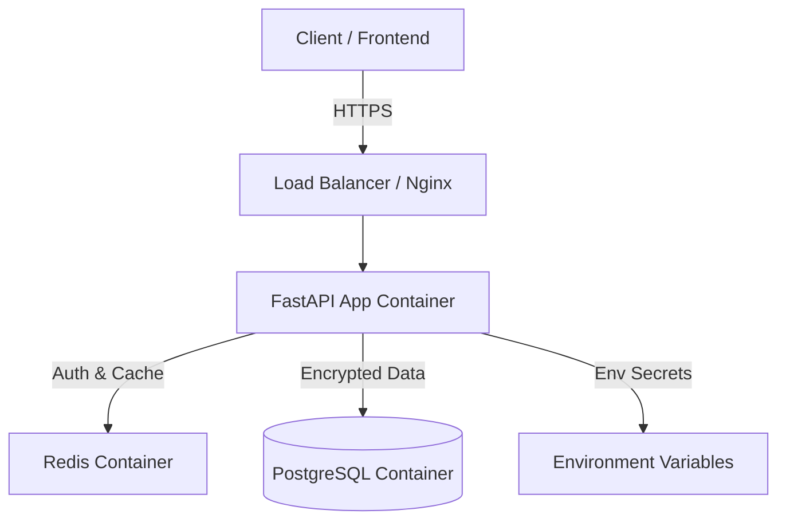

# 🎯 HabitForge

> A secure, scalable habit-tracking backend API built with FastAPI, PostgreSQL, and Docker.  
> Designed with a focus on data encryption, container orchestration, and system reliability.

[](https://www.python.org/)
[](https://fastapi.tiangolo.com/)
[](https://www.docker.com/)

[](https://app-6gvb.onrender.com)
[](https://app-6gvb.onrender.com/docs)
[](https://app-6gvb.onrender.com)

## 🚀 Features

- 🔐 **Secure Authentication**: JWT-based auth with refresh tokens and password hashing.
- 🔒 **Data Encryption**: Sensitive user notes encrypted at rest using **Fernet (symmetric encryption)**.
- 🐳 **Containerized Infrastructure**: Full stack orchestration with Docker Compose (App, PostgreSQL, Redis).
- 🛡️ **Security Best Practices**: CORS configuration, rate limiting, and environment-based secret management.
- 🧪 **Health Checks**: Automated container health checks to ensure service dependency readiness.
- 📚 **Auto-Generated Docs**: Interactive API documentation via Swagger UI & ReDoc.

## 🛠️ Tech Stack

| Component         | Technology                               |
| :---------------- | :--------------------------------------- |
| **Language**      | Python 3.11                              |
| **Framework**     | FastAPI, Uvicorn                         |
| **Database**      | PostgreSQL 16 (with SQLAlchemy/SQLModel) |
| **Cache & Queue** | Redis 7 (for rate limiting & sessions)   |
| **Security**      | JWT, Passlib, Cryptography (Fernet)      |
| **DevOps**        | Docker, Docker Compose                   |
| **Testing**       | Pytest, HTTPX                            |

## 🏗️ System Architecture



## 🏁 Getting Started (Local Development)

Prerequisites:

- Docker & Docker Compose installed
- Python 3.11+ (for key generation)

### 1. Clone the Repository

```bash
git clone https://github.com/yourusername/habitforge.git
cd habitforge
pip install -r requirements.txt
```

### 2. Configure Environment Variables

Create a `.env` file based on the example:

```bash
cp .env.example .env
```

**⚠️ Critical Security Step:**  
You must generate unique keys for encryption and security. Run these commands and paste the output into your `.env` file:

```bash
# Generate SECRET_KEY (32+ chars)
python -c "import secrets; print(secrets.token_urlsafe(32))"

# Generate DATA_ENCRYPTION_KEY (Fernet compatible)
python -c "from cryptography.fernet import Fernet; print(Fernet.generate_key().decode())"
```

### 3. Run with Docker

Build and start all services (App, DB, Redis):

```bash
docker-compose up --build
```

- **API Base URL**: `http://localhost:8000`
- **Interactive Docs**: `http://localhost:8000/docs`
- **Database**: `localhost:5432`

### 4. Run Tests

```bash
docker-compose exec app pytest
```

## 🔐 Security & Encryption

This project implements **field-level encryption** for sensitive user data.

- **Key Management**: Encryption keys are injected via environment variables at runtime, never stored in code.
- **Algorithm**: Fernet (built on AES-CBC + HMAC) ensures data cannot be decrypted without the specific key.
- **Password Storage**: Passwords are hashed using bcrypt via Passlib before storage.

## 🧠 Engineering Challenges & Solutions

| Challenge                    | Solution                                                                                                    |
| :--------------------------- | :---------------------------------------------------------------------------------------------------------- |
| **Secret Management**        | Implemented strict env var validation on startup to prevent insecure defaults.                              |
| **Database Race Conditions** | Used Docker `healthcheck` conditions to ensure DB is ready before App starts.                               |
| **Data Privacy**             | Integrated symmetric encryption for sensitive fields while maintaining queryability for non-sensitive data. |
| **Dependency Orchestration** | Configured multi-service Docker Compose with network isolation and volume persistence.                      |

## 📁 Project Structure

```
habitforge/
├── app/
│   ├── api/            # Route handlers (auth, habits, users)
│   ├── core/           # Config, security, dependencies
│   ├── models/         # SQLModel database schemas
│   ├── encryption.py   # Fernet encryption utilities
│   └── main.py         # Application entrypoint
├── tests/              # Unit and integration tests
├── docker-compose.yml  # Service orchestration
├── Dockerfile          # App container definition
├── .env.example        # Environment variable template
└── README.md
```

## 🤝 Contributing

Contributions are welcome! Please feel free to submit a Pull Request. For major changes, please open an issue first to discuss what you would like to change.

---
